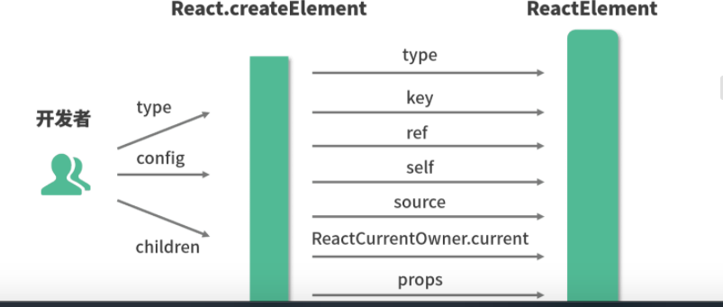
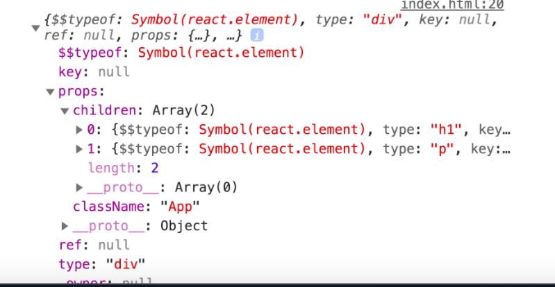

### 源码 !== 原理，源码是代码，而原理是逻辑，代码是繁杂冗长的，原理却可以是简洁清晰的。

## JSX代码是如何“摇身一变”成为DOM的？
 * JSX本质是什么？它和js有什么关系？
 * 为什么要用jsx? 不用会有什么后果？
 * JSX背后的功能模块是什么？这个功能模块做了哪些事情？

 -----------

React官网定义：JSX是Javascript的一种语法扩展，它和模板语言很接近，但是它充分具备JavaScript的能力；

-------

JSX 会被编译（[Babel来完成](https://www.babeljs.cn/repl#?browsers=defaults%2C%20not%20ie%2011%2C%20not%20ie_mob%2011&build=&builtIns=false&spec=false&loose=false&code_lz=DwEwlgbgfAUABHYALAjFATgUwIYGMAuwA9KrAsAA5QBG21mANnIGj-gi9HFUzHjRA&debug=false&forceAllTransforms=false&shippedProposals=false&circleciRepo=&evaluate=false&fileSize=false&timeTravel=false&sourceType=module&lineWrap=true&presets=env%2Creact%2Cstage-2&prettier=false&targets=&version=7.12.11&externalPlugins=)）为 React.createElement()， React.createElement() 将返回一个叫作“React Element”的 JS 对象。

JSX 的本质是React.createElement这个 JavaScript 调用的语法糖，这也就完美地呼应上了 React 官方给出的“JSX 充分具备 JavaScript 的能力”这句话。

### React 选用 JSX 语法的动机
JSX 语法糖允许前端开发者使用我们最为熟悉的类 HTML 标签语法来创建虚拟 DOM，在降低学习成本的同时，也提升了研发效率与研发体验。

### JSX 是如何映射为 DOM 的：起底 [createElement 源码](https://reactjs.org/docs/react-api.html#createelement)

```
/**
 707. React的创建元素方法 react-development.js
 */

export function createElement(type, config, children) {
  let propName; // propName 变量用于储存后面需要用到的元素属性
  const props = {}; // props 变量用于储存元素属性的键值对集合
  // key、ref、self、source 均为 React 元素的属性，此处不必深究
  let key = null;
  let ref = null; 
  let self = null; 
  let source = null; 
  
  if (config != null) { // config 对象中存储的是元素的属性
    // 进来之后做的第一件事，是依次对 ref、key、self 和 source 属性赋值
    if (hasValidRef(config)) {
      ref = config.ref;
    }
    // 此处将 key 值字符串化
    if (hasValidKey(config)) {
      key = '' + config.key; 
    }
    self = config.__self === undefined ? null : config.__self;
    source = config.__source === undefined ? null : config.__source;
    // 接着就是要把 config 里面的属性都一个一个挪到 props 这个之前声明好的对象里面
    for (propName in config) {
      if (
        // 筛选出可以提进 props 对象里的属性
        hasOwnProperty.call(config, propName) &&  /
        !RESERVED_PROPS.hasOwnProperty(propName) 
      ) {
        props[propName] = config[propName]; 
      }
    }
  }

  // childrenLength 指的是当前元素的子元素的个数，减去的 2 是 type 和 config 两个参数占用的长度
  const childrenLength = arguments.length - 2; 

  // 如果抛去type和config，就只剩下一个参数，一般意味着文本节点出现了
  if (childrenLength === 1) { 
    // 直接把这个参数的值赋给props.children
    props.children = children; 
    // 处理嵌套多个子元素的情况
  } else if (childrenLength > 1) { 
    // 声明一个子元素数组
    const childArray = Array(childrenLength); 
    // 把子元素推进数组里
    for (let i = 0; i < childrenLength; i++) { 
      childArray[i] = arguments[i + 2];
    }
    // 最后把这个数组赋值给props.children
    props.children = childArray; 
  }

  // 处理 defaultProps, 非div span这些h5元素
  if (type && type.defaultProps) {
    const defaultProps = type.defaultProps;
    for (propName in defaultProps) { 
      if (props[propName] === undefined) {
        props[propName] = defaultProps[propName];
      }
    }
  }

  // 最后返回一个调用ReactElement执行方法，并传入刚才处理过的参数
  return ReactElement(
    type,
    key,
    ref,
    self,
    source,
    ReactCurrentOwner.current,
    props,
  );
}
```

开发者 -------> 通过creatElement(参数整理的作用) ---------> 生成最后的 ReactElement


### ReactElement的源码解读
```
/**
 649. React元素 react-development.js
 */
const ReactElement = function(type, key, ref, self, source, owner, props) {
  const element = {
    // REACT_ELEMENT_TYPE是一个常量，用来标识该对象是一个ReactElement
    $$typeof: REACT_ELEMENT_TYPE,
    // 内置属性赋值
    type: type,
    key: key,
    ref: ref,
    props: props,
    // 记录创造该元素的组件
    _owner: owner,
  };
  return element;
};

```

ReactElement 对象实例，本质上是以 JavaScript 对象形式存在的对 DOM 的描述，也就是老生常谈的“虚拟 DOM”（准确地说，是虚拟 DOM 中的一个节点)

### 创建真实DOM —— ReactDoOM.render补充
```
ReactDOM.render(
    // 需要渲染的元素（ReactElement）
    element, 
    // 元素挂载的目标容器（一个真实DOM）
    container,
    // 回调函数，可选参数，可以用来处理渲染结束后的逻辑
    [callback]
)

````
生命周期的render方法创建虚拟dom节点，再通过调用ReactDOM.render 实现正式DOM


### react生命周期 what--->how的学习， react v15 与react v16

