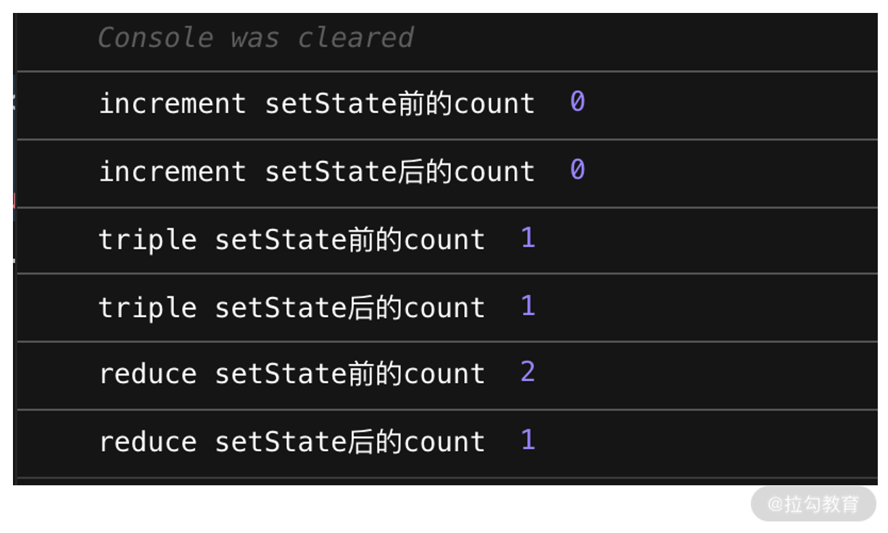

```
import React from "react";

export default class App extends React.Component{
  state = {
    count: 0
  }

  increment = () => {
    console.log('increment setState前的count', this.state.count)
    this.setState({
      count: this.state.count + 1
    });
    console.log('increment setState后的count', this.state.count)
  }

  triple = () => {
    console.log('triple setState前的count', this.state.count)
    this.setState({
      count: this.state.count + 1
    });

    this.setState({
      count: this.state.count + 1
    });

    this.setState({
      count: this.state.count + 1
    });

    console.log('triple setState后的count', this.state.count)
  }

  reduce = () => {
    setTimeout(() => {
      console.log('reduce setState前的count', this.state.count)
      this.setState({
        count: this.state.count - 1
      });
      console.log('reduce setState后的count', this.state.count)
    },0);
  }

  render(){
    return (
      <div>
        <button onClick={this.increment}>点我增加</button>
        <button onClick={this.triple}>点我增加三倍</button>
        <button onClick={this.reduce}>点我减少</button>
      </div>
    )
  }
}

```



## 为什么 setTimeout 可以将 setState 的执行顺序从异步变为同步？

并不是 setTimeout 改变了 setState，而是 setTimeout 帮助 setState “逃脱”了 React 对它的管控。只要是在 React 管控下的 setState，一定是异步的。

setState 并不是单纯同步/异步的，它的表现会因调用场景的不同而不同：在 React 钩子函数及合成事件中，它表现为异步；而在 setTimeout、setInterval 等函数中，包括在 DOM 原生事件中，它都表现为同步。这种差异，本质上是由 React 事务机制和批量更新机制的工作方式来决定的